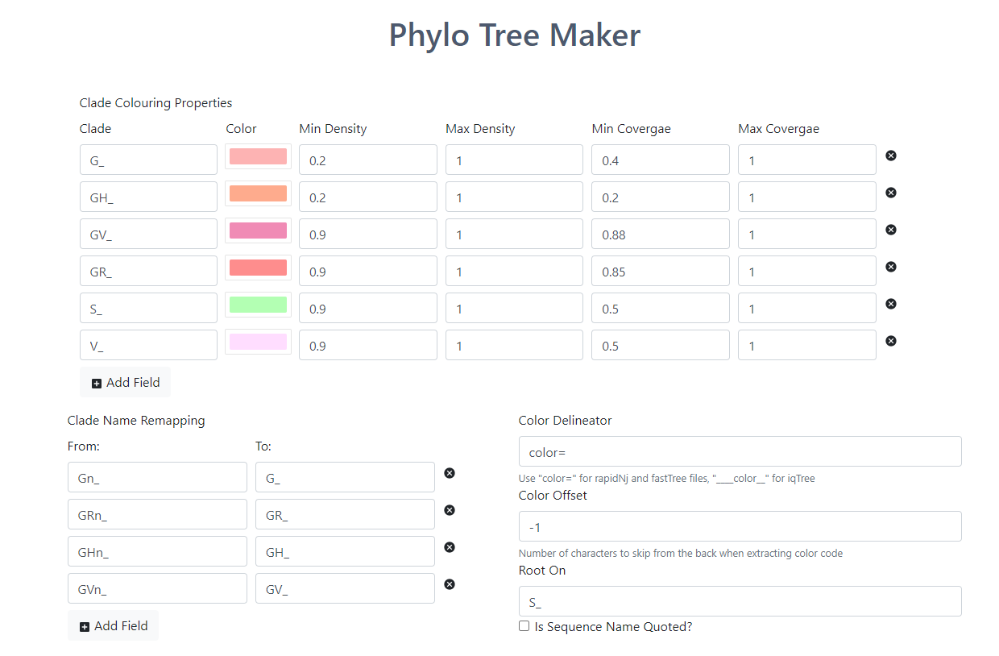
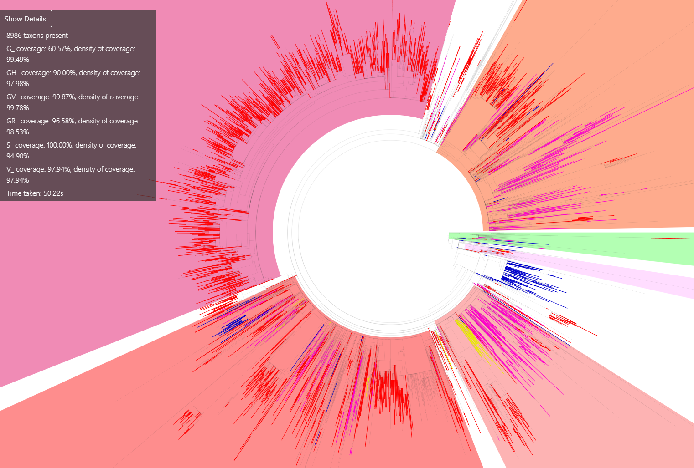

# Phylogenetic Tree Visualizer

Colors a phylogenetic tree base on sequence name for an input newick file.

Features:

- Specify Clades and its colour
- Specify the parameters for the colouring
- Specify the out group clade
- specify the color markers
- Remap certain clades to the one that you wish to be coloured

## How it works

Utilizes consensus coloring to try and find the best ancestor node to be coloured based on two properties:

- Density of clade under ancestor node
- Coverage of clade under ancestor node

The sum of both acts as the score and ancestor with the maximum score is chosen to be coloured.

## Screenshots

Upload screen:

Output Screen:

## Contribution

If you notice anything wrong or missing, feel free to open an issue!

## License

Copyright 2020 Winston Yeo, Sebastian Maurer-Stroh

Permission is hereby granted, free of charge, to any person obtaining a copy of this software and associated documentation files (the "Software"), to deal in the Software without restriction, including without limitation the rights to use, copy, modify, merge, publish, distribute, sublicense, and/or sell copies of the Software, and to permit persons to whom the Software is furnished to do so, subject to the following conditions:

The above copyright notice and this permission notice shall be included in all copies or substantial portions of the Software.

THE SOFTWARE IS PROVIDED "AS IS", WITHOUT WARRANTY OF ANY KIND, EXPRESS OR IMPLIED, INCLUDING BUT NOT LIMITED TO THE WARRANTIES OF MERCHANTABILITY, FITNESS FOR A PARTICULAR PURPOSE AND NONINFRINGEMENT. IN NO EVENT SHALL THE AUTHORS OR COPYRIGHT HOLDERS BE LIABLE FOR ANY CLAIM, DAMAGES OR OTHER LIABILITY, WHETHER IN AN ACTION OF CONTRACT, TORT OR OTHERWISE, ARISING FROM, OUT OF OR IN CONNECTION WITH THE SOFTWARE OR THE USE OR OTHER DEALINGS IN THE SOFTWARE.
